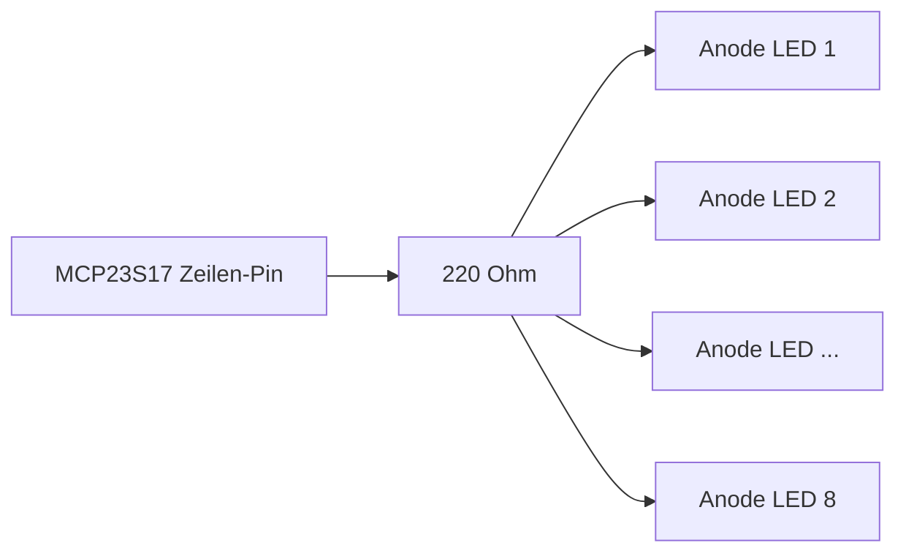

The passive components are the invisible foundation that ensures the stability and reliability of the entire system. Their absence is one of the most common causes of difficult-to-diagnose errors such as "random" reboots, incorrect sensor values, or "ghost" key presses.

Here is a complete list of all the passive components you need to add, divided by function, including an explanation of why they are necessary.

**Summary of Necessary Passive Components**

| Component                            | Where & How Many?                                                                                                   | Function (Why is it necessary?)                                                                                                                                                                                                                       |
| ------------------------------------ | ------------------------------------------------------------------------------------------------------------------- | ----------------------------------------------------------------------------------------------------------------------------------------------------------------------------------------------------------------------------------------------------- |
| **10kΩ Resistors**                   | **ESP1:** 1x per NPN sensor (Hall sensor, Probes). Between the signal pin and 3.3V.                                 | **Pull-up for NPN Sensors:** NPN sensors have an "open-collector" output. Without this resistor, the pin "floats" in an undefined state. The resistor pulls the pin to a clear HIGH level (3.3V) when the sensor is inactive.                         |
| **220Ω Resistors**                   | **ESP2:** 1x per row of the LED matrix (8 total). In series between the MCP23S17 pin and the anode line of the row. | **Current Limiting for LEDs:** LEDs are not light bulbs. Without a resistor, they would draw unlimited current and burn out immediately. This resistor limits the current to a safe level (approx. 15mA).                                             |
| **1N4148 Diodes**                    | **ESP2:** 1x per switch in the button matrix (64 total). In series with each individual switch.                     | **Anti-Ghosting / N-Key Rollover:** Prevents "ghost" key presses. If you press three keys that form a rectangle, the fourth corner can be detected as pressed without diodes. The diode acts as a one-way valve for the current, preventing this.     |
| **100nF (0.1µF) Ceramic Capacitors** | 1x per IC (2x ESP32, all MCP23S17, all TXS0108E). As close as possible to the VCC/GND pins of the chip.             | **Decoupling:** Digital chips cause tiny, high-frequency current spikes when switching. These capacitors act as local mini-buffers, smoothing these spikes and thus preventing system instabilities and crashes. This is a fundamental best practice. |

**Detailed Explanations and Circuit Diagrams**

**1. Pull-up Resistors for NPN Sensors (on ESP1)**

Each of your NPN sensors (Hall sensor NJK-5002C, Probes SN04-N) requires an external pull-up resistor.

- **Circuit:**

- **Erklärung:** Wenn der Sensor kein Metall detektiert, ist sein Ausgang hochohmig. Der 10kΩ-Widerstand zieht den GPIO-Pin des ESP32 sicher auf 3.3V (HIGH). Wenn der Sensor Metall detektiert, schaltet sein interner Transistor durch und zieht den GPIO-Pin auf GND (LOW). Dies erzeugt ein sauberes, eindeutiges digitales Signal.

**2. Strombegrenzungswiderstände für die LED-Matrix (an ESP2)**

Sie benötigen **nicht** 64 Widerstände, sondern nur 8 – einen für jede Zeile.

- **Schaltung (für eine Zeile):**

- **Erklärung:** Die Ansteuerung der Matrix erfolgt per Multiplexing. Es wird immer nur eine Spalte gleichzeitig aktiviert (über die MOSFETs). Der Strom fließt vom MCP23S17 durch den Widerstand zu den Anoden der LEDs in der aktiven Zeile. Der 220Ω-Widerstand ist ein guter Allround-Wert für 5V-Systeme, um eine gute Helligkeit bei ca. 15mA zu erreichen.

**3. Dioden für die Tastenmatrix (an ESP2)**

Dies ist entscheidend für eine zuverlässige Tastatur, die auch mehrere gleichzeitige Tastendrücke korrekt erkennt.

- **Schaltung (für einen Taster):**

- **Erklärung:** Die Diode (z.B. 1N4148) wird in Serie zu jedem Taster geschaltet. Der Strich auf der Diode (Kathode) muss in Richtung des Zeilen-Pins zeigen. Dies stellt sicher, dass der Strom nur von der Spalte zur Zeile fließen kann, wenn eine Taste gedrückt wird, und verhindert Rückflüsse, die zu "Ghosting" führen würden.

**4. Entkopplungskondensatoren (an allen ICs)**

Dies ist nicht optional, sondern für einen stabilen Betrieb unerlässlich.

- **Schaltung:**

- **Erklärung:** Platzieren Sie einen 100nF-Keramikkondensator so nah wie physisch möglich zwischen den VCC- und GND-Pins jedes einzelnen integrierten Schaltkreises (IC). Das gilt für beide ESP32, alle MCP23S17 und alle TXS0108E Pegelwandler.

**Optionale, aber empfohlene Bauteile**

| Bauteil                                  | Wo & Wie Viele?                                                                               | Funktion (Warum ist es nützlich?)                                                                                                                                                                                                                                                                                             |
| ---------------------------------------- | --------------------------------------------------------------------------------------------- | ----------------------------------------------------------------------------------------------------------------------------------------------------------------------------------------------------------------------------------------------------------------------------------------------------------------------------- |
| **10µF - 100µF Elektrolytkondensatoren** | 1x am Ausgang jedes XL4015-Moduls (also 2 Stück).                                             | **Glättung der Versorgungsspannung:** Diese größeren Kondensatoren helfen, niederfrequente Schwankungen und Restwelligkeit von den Schaltreglern (XL4015) zu filtern und sorgen für eine noch stabilere 3.3V- und 5V-Versorgung für das gesamte System.                                                                       |
| **0.1µF (100nF) Keramikkondensatoren**   | 2x pro mechanischem Encoder (z.B. KY-040). Jeweils von Pin A nach GND und von Pin B nach GND. | **Hardware-Entprellung für Encoder:** Mechanische Encoder können stark "prellen" (elektrisches Rauschen erzeugen). Diese Kondensatoren bilden zusammen mit den internen Pull-up-Widerständen einen Tiefpassfilter, der hochfrequentes Rauschen unterdrückt und die Signalqualität für die ESP32Encoder-Bibliothek verbessert. |

In Google Sheets exportieren

Wenn Sie all diese passiven Komponenten berücksichtigen, bauen Sie eine Hardware-Basis, die robust, stabil und deutlich weniger anfällig für unerklärliche Fehler ist.

Quellen und ähnliche Inhalte

[SN04-N (Inductive Proximity Sensor, NPN, wires NO, 6-36V DC, 18x18x36mm)](https://www.techonicsltd.com/sn04-n-inductive-proximity-sensor-npn-wires-no-6-36v-dc-18x18x36mm/"%20\t%20"_blank)

[techonicsltd.com/sn04-n-inductive-proximity-sensor-npn-wires-no-6-36v-dc-18x18x36mm](https://www.techonicsltd.com/sn04-n-inductive-proximity-sensor-npn-wires-no-6-36v-dc-18x18x36mm/"%20\t%20"_blank)

[RobTillaart/MCP23017_RT: Arduino library for I2C MCP23017 16 channel port expander - GitHub](https://github.com/RobTillaart/MCP23017_RT"%20\t%20"_blank)

[github.com/RobTillaart/MCP23017_RT](https://github.com/RobTillaart/MCP23017_RT"%20\t%20"_blank)

[ESP32 Save Data Permanently using Preferences Library - IoT Circuit Hub](https://iotcircuithub.com/esp32-preferences-library-tutorial/"%20\t%20"_blank)

[iotcircuithub.com/esp32-preferences-library-tutorial](https://iotcircuithub.com/esp32-preferences-library-tutorial/"%20\t%20"_blank)

**Drehschalter**

Bei den Drehschaltern, die an die digitalen Eingänge des MCP23S17 angeschlossen werden, sind **keine externen Widerstände notwendig**.

Der Grund dafür ist, dass der MCP23S17-Chip für jeden seiner Eingänge über **interne Pull-up-Widerstände** verfügt. Diese werden direkt im Code (mcp.pinMode(pin, INPUT_PULLUP);) aktiviert. Der interne Widerstand (ca. 100 kΩ) sorgt dafür, dass der Eingangspin ein stabiles HIGH-Signal hat, solange der Schalter offen ist. Wenn der Schalter eine Position schließt und den Pin mit Masse (GND) verbindet, wird der Eingang eindeutig als LOW erkannt.

**Potentiometer**

Für die Potentiometer sind ebenfalls **keine zusätzlichen Widerstände für die Grundfunktion erforderlich**.

Ein Potentiometer ist im Grunde bereits ein verstellbarer Widerstand, der hier als Spannungsteiler verwendet wird:

- Die beiden äußeren Anschlüsse werden direkt an **3.3V** und **GND** angeschlossen.
- Der mittlere Anschluss (Schleifer) wird direkt mit dem analogen Eingang (ADC-Pin) des ESP32 verbunden.

Dadurch liefert das Potentiometer je nach Drehposition eine saubere Spannung zwischen 0V und 3.3V an den ESP32, ohne dass weitere Widerstände nötig sind.

💡 **Tipp für stabile Messwerte:** Um das Rauschen bei den Potentiometer-Messungen zu reduzieren, ist es empfehlenswert, einen kleinen **Keramikkondensator** (ca. 10 nF bis 100 nF) zwischen dem mittleren Anschluss (ADC-Pin) und GND zu schalten. Dies ist aber optional und kein Widerstand.
