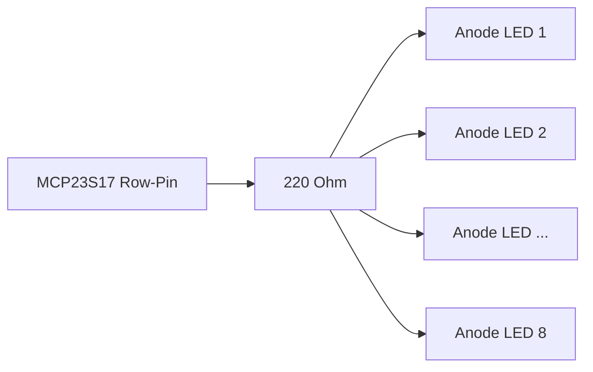

The passive components are the invisible foundation that ensures the stability and reliability of the entire system. Their absence is one of the most common causes of difficult-to-diagnose errors such as "random" reboots, incorrect sensor values, or "ghost" key presses.

Here is a complete list of all the passive components you need to add, divided by function, including an explanation of why they are necessary.

**Summary of Necessary Passive Components**

| Component                            | Where & How Many?                                                                                                   | Function (Why is it necessary?)                                                                                                                                                                                                                       |
| ------------------------------------ | ------------------------------------------------------------------------------------------------------------------- | ----------------------------------------------------------------------------------------------------------------------------------------------------------------------------------------------------------------------------------------------------- |
| **10kΩ Resistors**                   | **ESP1:** 1x per NPN sensor (Hall sensor, Probes). Between the signal pin and 3.3V.                                 | **Pull-up for NPN Sensors:** NPN sensors have an "open-collector" output. Without this resistor, the pin "floats" in an undefined state. The resistor pulls the pin to a clear HIGH level (3.3V) when the sensor is inactive.                         |
| **220Ω Resistors**                   | **ESP2:** 1x per row of the LED matrix (8 total). In series between the MCP23S17 pin and the anode line of the row. | **Current Limiting for LEDs:** LEDs are not light bulbs. Without a resistor, they would draw unlimited current and burn out immediately. This resistor limits the current to a safe level (approx. 15mA).                                             |
| **1N4148 Diodes**                    | **ESP2:** 1x per switch in the button matrix (64 total). In series with each individual switch.                     | **Anti-Ghosting / N-Key Rollover:** Prevents "ghost" key presses. If you press three keys that form a rectangle, the fourth corner can be detected as pressed without diodes. The diode acts as a one-way valve for the current, preventing this.     |
| **100nF (0.1µF) Ceramic Capacitors** | 1x per IC (2x ESP32, all MCP23S17, all TXS0108E). As close as possible to the VCC/GND pins of the chip.             | **Decoupling:** Digital chips cause tiny, high-frequency current spikes when switching. These capacitors act as local mini-buffers, smoothing these spikes and thus preventing system instabilities and crashes. This is a fundamental best practice. |

**Detailed Explanations and Circuit Diagrams**

**1. Pull-up Resistors for NPN Sensors (on ESP1)**

Each of your NPN sensors (Hall sensor NJK-5002C, Probes SN04-N) requires an external pull-up resistor.

- **Circuit:**

- **Explanation:** When the sensor does not detect metal, its output is high-impedance. The 10kΩ resistor reliably pulls the ESP32's GPIO pin to 3.3V (HIGH). When the sensor detects metal, its internal transistor switches on and pulls the GPIO pin to GND (LOW). This creates a clean, unambiguous digital signal.

**2. Current-Limiting Resistors for the LED Matrix (on ESP2)**

You do **not** need 64 resistors, only 8—one for each row.

- **Circuit (for one row):**

- **Explanation:** The matrix is driven by multiplexing. Only one column is activated at a time (via the MOSFETs). The current flows from the MCP23S17 through the resistor to the anodes of the LEDs in the active row. The 220Ω resistor is a good all-around value for 5V systems to achieve good brightness at approx. 15mA.

**3. Diodes for the Button Matrix (on ESP2)**

This is crucial for a reliable keyboard that correctly recognizes multiple simultaneous key presses.

- **Circuit (for one switch):**

- **Explanation:** The diode (e.g., 1N4148) is placed in series with each switch. The stripe on the diode (cathode) must point towards the row pin. This ensures that current can only flow from the column to the row when a key is pressed, preventing backflow that would lead to "ghosting."

**4. Decoupling Capacitors (on all ICs)**

This is not optional but is essential for stable operation.

- **Circuit:**

- **Explanation:** Place a 100nF ceramic capacitor as physically close as possible between the VCC and GND pins of every single integrated circuit (IC). This applies to both ESP32s, all MCP23S17s, and all TXS0108E level shifters.

**Optional but Recommended Components**

| Component                                | Where & How Many?                                                                           | Function (Why is it useful?)                                                                                                                                                                                                                                                                          |
| ---------------------------------------- | ------------------------------------------------------------------------------------------- | ----------------------------------------------------------------------------------------------------------------------------------------------------------------------------------------------------------------------------------------------------------------------------------------------------- |
| **10µF - 100µF Electrolytic Capacitors** | 1x at the output of each XL4015 module (2 total).                                           | **Smoothing the Supply Voltage:** These larger capacitors help to filter out low-frequency fluctuations and ripple from the switching regulators (XL4015), ensuring an even more stable 3.3V and 5V supply for the entire system.                                                                     |
| **0.1µF (100nF) Ceramic Capacitors**     | 2x per mechanical encoder (e.g., KY-040). One from pin A to GND, and one from pin B to GND. | **Hardware Debouncing for Encoders:** Mechanical encoders can "bounce" significantly (create electrical noise). These capacitors, together with the internal pull-up resistors, form a low-pass filter that suppresses high-frequency noise and improves signal quality for the ESP32Encoder library. |

If you include all these passive components, you will build a hardware base that is robust, stable, and significantly less prone to unexplainable errors.

**DrehschRotary Switchesalter**

For the rotary switches connected to the digital inputs of the MCP23S17, **no external resistors are necessary**.

The reason for this is that the MCP23S17 chip has **internal pull-up resistors** for each of its inputs. These are activated directly in the code (mcp.pinMode(pin, INPUT_PULLUP);). The internal resistor (approx. 100 kΩ) ensures that the input pin has a stable HIGH signal as long as the switch is open. When the switch closes a position and connects the pin to ground (GND), the input is clearly recognized as LOW.

**Potentiometers**

For the potentiometers, **no additional resistors are required for their basic function**.

A potentiometer is essentially an adjustable resistor used here as a voltage divider:

- The two outer terminals are connected directly to **3.3V and GND**.
- The middle terminal (wiper) is connected directly to an analog input (ADC pin) of the ESP32.

This setup provides a clean voltage between 0V and 3.3V to the ESP32 depending on the knob's position, without the need for further resistors.

💡 **Tip for Stable Readings:** o reduce noise on the potentiometer readings, it is advisable to place a small **ceramic capacitor** (approx. 10 nF to 100 nF) between the middle terminal (ADC pin) and GND. However, this is optional and is a capacitor, not a resistor.
