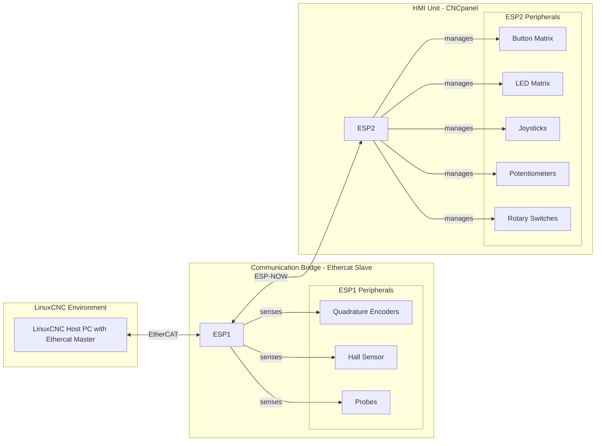

# Integrated Dual-ESP32 HMI for LinuxCNC

An advanced, modular Human-Machine Interface (HMI) for LinuxCNC-controlled machines. The system utilizes a dual-ESP32 architecture to decouple real-time machine communication from the complex HMI logic. The connection to LinuxCNC is handled by the industrial **EtherCAT** protocol, while the two controllers communicate wirelessly with low latency via **ESP-NOW**.

The core of this project is the **"Fixed Maximum"** approach. A master data structure (`MyData.h`) is created once with the official EasyCAT Configurator tool, defining all possible inputs and outputs. The firmware is then configured at compile-time to use a specific subset of this hardware (CNCpanel), providing stability and simplicity. The HMI's functional logic (joystick tuning, button modes) remains fully configurable via a dynamic **web interface** (hosted by ESP2).

## System Architecture



## Features

- **Robust Dual-ESP32 Architecture:** Decoupling of real-time (ESP1) and non-time-critical (ESP2) tasks.
- **Industrial Real-Time Communication:** Connection to LinuxCNC via deterministic EtherCAT.
- **Low-Latency Wireless Link:** ESP-NOW for responsive communication between the controllers.
- **Dynamic Web Interface:** Live status monitoring and complete run-time configuration of the HMI's (ESP2)functional logic (joystick tuning, button modes, LED bindings) without recompiling.
- **Over-The-Air (OTA) Updates:** Conveniently update the HMI controller's firmware via Wi-Fi (ESP2).
- **Automated Helper File Generation:** A Python script parses your master `MyData.h` file to automatically generate a descriptive HAL template and Markdown documentation, preventing manual errors.
- **Comprehensive Peripheral Support:** Direct connection of encoders, industrial sensors, button matrices, joysticks, potentiometers, and rotary switches.

### Maximum Peripheral Hardware Connectivity

The system is designed to connect a variety of high-speed and user-interface peripherals, which are strategically split between the two ESP32 controllers. The following table summarizes the maximum number of connectable devices for each controller based on the project's design.

| Peripheral                     | Connected to | Maximum Number | Notes                                                                                           |
| :----------------------------- | :----------- | :------------- | :---------------------------------------------------------------------------------------------- |
| **Quadrature Encoders**        | ESP1         | 8              | For high-speed position feedback directly tied to the machine controller.                       |
| **Hall Sensor (Spindle)**      | ESP1         | 1              | For real-time spindle RPM measurement.                                                          |
| **Inductive Probes**           | ESP1         | 8              | For homing, probing, and other high-priority machine inputs.                                    |
| **Button Matrix**              | ESP2         | 64 (8x8)       | The primary user input for commands and jogging.                                                |
| **LED Matrix**                 | ESP2         | 64 (8x8)       | Provides visual feedback on machine and HMI status.                                             |
| **Quadrature Encoders**        | ESP2         | 8              | For user inputs like jog wheels or overrides.                                                   |
| **Potentiometers / Joysticks** | ESP2         | 6              | Used for analog inputs like feedrate override or joystick axes.                                 |
| **Rotary Switches**            | ESP2         | 4              | For selecting machine operating modes. Each Rotary Switch with up to 8 positions (configurable) |

---

## Prerequisites

### Hardware Philosophy: Modular and Accessible

This project's design prioritizes the use of pre-built, multi-channel modules and breakout boards. This approach significantly simplifies the hardware implementation, minimizing the need for complex custom PCB design or extensive point-to-point soldering. By leveraging widely available modules, the system is faster to assemble, easier to debug, and more accessible for replication.

The core components are selected for their channel density and ease of integration into a larger system.

| Module                   | Function                    | Channels    | Required Quantity | Example Link(s)                                                      |
| :----------------------- | :-------------------------- | :---------- | :---------------- | :------------------------------------------------------------------- |
| **EasyCAT PRO Shield**   | EtherCAT Slave Interface    | N/A         | 1                 | [Official Page](http://www.bausano.net/en/hardware/easycat-pro.html) |
| **MOSFET Driver Module** | LED Column Driver           | 4 Channels  | 2                 | [AliExpress](https://de.aliexpress.com/item/1005006825918157.html)   |
| **MCP23S17 Module**      | SPI I/O Expander            | 16 Channels | 4                 | [AliExpress](https://de.aliexpress.com/item/1005006642757928.html)   |
| **TXS0108E Module**      | Bidirectional Level Shifter | 8 Channels  | 1                 | [AliExpress](https://de.aliexpress.com/item/1005008226957385.html)   |
| **XL4015 Module**        | DC-DC Buck Converter        | 1 Channel   | 2                 | [AliExpress](https://de.aliexpress.com/item/1005008174536853.html)   |

### Hardware

- 2x ESP32 DevKitC (or similar)
- 1x EasyCAT PRO Shield
- 1x Stable 12V Power Supply (e.g., DIN rail power supply)
- DC-DC Buck Converters for 5V and 3.3V (e.g., XL4015)
- SPI I/O Expanders (MCP23S17)
- Bidirectional Level Shifters (TXS0108E) for the 3.3V/5V SPI bus
- N-Channel MOSFETs (IRL540N) for driving the LED matrix columns
- Peripheral Components: Buttons, LEDs, joysticks, potentiometers, encoders, industrial sensors.
- A LinuxCNC host PC with a configured EtherCAT master interface.

### Software

- [Visual Studio Code](https://code.visualstudio.com/) with the [PlatformIO IDE extension](https://platformio.org/platformio-ide)
- [Python 3.x](https://www.python.org/downloads/)
  The Python library `requests`: `pip install requests`
- The [EasyCAT Configurator Tool](http://www.bausano.net/en/hardware/easycat-pro.html) (required once to create the template)

---

## Implementation

### Step 1: Create the Master Data Configuration

This is the most critical step and serves as the foundation for the project.

1.  **Define Your Hardware:** Decide on the **maximum** number of peripherals your system will ever support (e.g., 8 encoders, 2 joysticks, etc.).
2.  **Run the EasyCAT Configurator Tool:**
    - Launch the EasyCAT Configurator.
    - Define all your input and output variables according to your "Fixed Maximum" hardware plan. Use descriptive names (e.g., `enc_pos`, `spindle_rpm`, `button_matrix`).
    - Click **"Create Files"** to generate the three master files: `MyData.h`, `MyData.xml`, and `MyData.bin`.
3.  **Place Files in Your Project:**
    - Copy the generated `MyData.h` file into the `src/esp1/` directory of your project.
    - Copy the generated `MyData.xml` (rename it to `HMI_Slave.xml` or similar if desired) to your LinuxCNC master's configuration folder.
4.  **Program the EEPROM:**
    - Connect the EasyCAT shield directly to your PC's Ethernet port.
    - Use the "Write EEPROM" function in the EasyCAT Configurator to upload the generated `MyData.bin` file to the shield. This only needs to be done once.

### Step 2: One-Time Project Setup

1.  **Clone the Repository:** Clone this repository to your development machine.
2.  **Configure Wi-Fi Credentials:** Open `src/esp2/config_esp2.h` and enter your Wi-Fi credentials.
3.  **Enter MAC Addresses:** Determine the MAC addresses of your two ESP32 boards and enter them into the `include/shared_structures.h` file.

### Step 3: Application Logic Configuration

- **Static Hardware Mapping (in the `config.h` files):**

  - Open `src/esp1/config_esp1.h` and `src/esp2/config_esp2.h`.
  - Define the **actual number** of devices you are currently using (`NUM_ENCODERS`, `NUM_JOYSTICKS`, etc.) and their **physical pin assignments**. This tells the firmware which parts of the "Fixed Maximum" data structure to actively use.

- **Dynamic Functional Configuration (in the Web Interface):**
  - After uploading the firmware, connect to the web interface.
  - Here, you define the **logical function** of the control elements:
    - Names and modes (momentary/toggle) of the buttons.
    - Linking LEDs to buttons or LinuxCNC states.
    - Calibration and tuning of joysticks (sensitivity, deadzone, inversion).

### Step 4: Generate Helper Files

The Python script reads your master `MyData.h` to generate helper files. This is not part of the build process and should be run manually after any changes to `MyData.h`.

1.  **Open a PlatformIO CLI Terminal.**
2.  Run the command:
    ```bash
    python scripts/generate_mapping.py
    ```
3.  This will create/update `hmi.hal` and `mapping_doku.md` in the `generated_config/` folder.

### Step 5: Compiling and Uploading

1.  **Upload Filesystem:** Upload the web interface files to the **ESP2**. You can find the command in the PlatformIO menu:
    ```
    ┌──────────────────────────────┐
    │                              │
    │  PROJECT TASKS               │
    │  ▼ env:esp2                  │  // 1. Expand this environment
    │    ├─ ...                   │
    │    ├─ Platform               │  // 2. Expand this folder
    │    │  ├─ ...                 │
    │    │  └─ Upload Filesystem Image  <-- 3. CLICK HERE
    │    └─ ...                     │
    │                              │
    └──────────────────────────────┘
    ```
2.  **Upload Firmware:**
    - Compile and upload the `esp1` environment to your **ESP1** controller.
    - Compile and upload the `esp2` environment to your **ESP2** controller.

### Step 6: Commissioning

1.  **Dynamic Configuration:** Connect to the Wi-Fi and open the IP address of the ESP2 in a browser to perform final tuning.
2.  **LinuxCNC Integration:**
    - Ensure your `MyData.xml` is in the EtherCAT master's folder.
    - Integrate the generated `generated_config/hmi.hal` into your main HAL configuration to link the HMI signals to LinuxCNC functions.
3.  **Testing:** Start the system and test the entire data flow.
