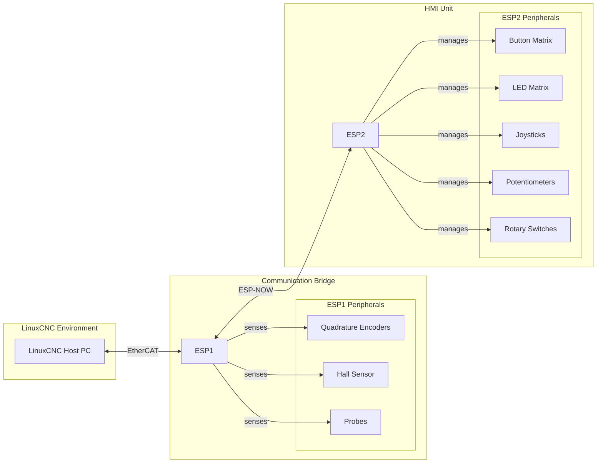

# Integrated Dual-ESP32 HMI for LinuxCNC

An advanced, modular Human-Machine Interface (HMI) for LinuxCNC-controlled machines. The system utilizes a dual-ESP32 architecture to decouple real-time machine communication from the complex HMI logic. The connection to LinuxCNC is handled by the industrial **EtherCAT** protocol, while the two controllers communicate wirelessly with low latency via **ESP-NOW**.

The entire HMI logic is configured dynamically via an integrated **web interface**, and the system-critical configuration files are automatically generated by a script to ensure maximum consistency and maintainability.

## System Architecture



    ## Features

- **Robust Dual-ESP32 Architecture:** Decoupling of real-time (ESP1) and non-time-critical (ESP2) tasks.
- **Industrial Real-Time Communication:** Connection to LinuxCNC via deterministic **EtherCAT**.
- **Low-Latency Wireless Link:** **ESP-NOW** for responsive communication between the controllers.
- **Dynamic Web Interface:** Complete configuration of the HMI logic (buttons, LEDs, joysticks) in the browser without recompiling.
- **Over-The-Air (OTA) Updates:** Conveniently update the HMI controller's firmware via Wi-Fi.
- **Automated Configuration Generation:** A Python script automatically generates all system-critical mapping files (`MyData.h`, `ESI.xml`, `.hal` template), guaranteeing perfect consistency.
- **Comprehensive Peripheral Support:** Direct connection of encoders, industrial sensors, button matrices, joysticks, potentiometers, and rotary switches.

---

## Prerequisites

### Hardware

- 2x ESP32 DevKitC (or similar)
- 1x EasyCAT PRO Shield
- 1x Stable 12V Power Supply (e.g., DIN rail power supply)
- DC-DC Buck Converters for 5V and 3.3V (e.g., XL4015)
- SPI I/O Expanders (MCP23S17)
- Bidirectional Level Shifters (TXS0108E) for the 3.3V/5V SPI bus
- N-Channel MOSFETs (IRL540N) for driving the LED matrix columns
- Peripheral Components: Buttons, LEDs, joysticks, potentiometers, encoders (e.g., AS5311), industrial sensors (e.g., NJK-5002C, SN04-N)
- A LinuxCNC host PC with a configured EtherCAT master interface

### Software

- [Visual Studio Code](https://code.visualstudio.com/) with the [PlatformIO IDE extension](https://platformio.org/platformio-ide)
- [Python 3.x](https://www.python.org/downloads/)
- The Python library `requests`: `pip install requests`
- The [EasyCAT Configurator Tool](http://www.bausano.net/en/hardware/easycat-pro.html) (required once to create the template)

---

## Implementation

### Step 1: Hardware Assembly

Assemble the circuit according to the schematics described in the detailed project document. Pay special attention to:

- A **stable and clean power supply** for the 3.3V and 5V rails.
- A **common ground (GND)** for all components.
- The correct wiring of the **bidirectional level shifter** for the SPI bus between ESP2 (3.3V) and the MCP23S17 expanders (5V).
- [cite_start]**IMPORTANT:** The `Output-Enable` (OE) pin of the TXS0108E level shifter must be controlled by a GPIO on the ESP2 to prevent boot issues. [cite: 140-143]

### Step 2: One-Time Project Setup

1.  **Clone the Repository:** Clone this repository to your development machine.
2.  **Create and Copy the Template:**
    - Run the **EasyCAT Configurator Tool** _once_ to generate a basic `MyData.xml`.
    - Copy **only this `MyData.xml`** into the `scripts/` directory and rename it to `HMI_Slave_template.xml`. This file serves as a stable hardware template. The `MyData.h` from the tool is **not** needed for this step.
3.  **Configure Wi-Fi Credentials:** Open `src/esp2/config_esp2.h` and enter your Wi-Fi credentials.
4.  **Enter MAC Addresses:** Determine the MAC addresses of your two ESP32 boards and enter them into the `include/shared_structures.h` file.

### Step 3: Application Logic Configuration

The configuration of the application data is done in two places; **a `MyData.h` file is not edited manually**:

- **1. Static Hardware Mapping (in the `config.h` files):**

  - Open `src/esp1/config_esp1.h` and `src/esp2/config_esp2.h`.
  - Define the **number** of devices used (`NUM_ENCODERS`, `NUM_JOYSTICKS`, etc.) and their **physical assignment** (GPIO pins, `poti_index` for joysticks). This defines _what_ hardware is physically present.

- **2. Dynamic Functional Configuration (in the Web Interface):**
  - After uploading the firmware for the first time, connect to the web interface.
  - Here, you define the **logical function** of the control elements:
    - Names and modes (momentary/toggle) of the buttons.
    - Linking LEDs to buttons or LinuxCNC states.
    - Calibration and tuning of joysticks (sensitivity, deadzone, inversion).

### Step 4: Compiling and Uploading

1.  **Generate Configurations:**
    - Start a build for the `esp1` environment (e.g., by running `pio run -e esp1` in the PlatformIO CLI).
    - The Python script `scripts/generate_mapping.py` will be executed automatically. It reads your `.h` configs, fetches the configuration from the web UI (if available), populates the `HMI_Slave_template.xml`, and generates **all final files**, including a new `src/esp1/MyData.h`.
2.  **Upload Filesystem:** Upload the filesystem for the **ESP2**. You can find the command in the PlatformIO menu (left sidebar):
    ```
    ┌──────────────────────────────┐
    │                              │
    │  PROJECT TASKS               │
    │  ▼ env:esp1                  │
    │  ▼ env:esp2                  │  // 1. Expand this environment
    │    ├─ ...                   │
    │    ├─ Platform               │  // 2. Expand this folder
    │    │  ├─ ...                 │
    │    │  └─ Upload Filesystem Image  <-- 3. CLICK HERE
    │    └─ ...                     │
    │                              │
    └──────────────────────────────┘
    ```
3.  **Upload Firmware:**
    - Compile and upload the `esp1` environment to your **ESP1** controller.
    - Compile and upload the `esp2` environment to your **ESP2** controller.

### Step 5: Commissioning

1.  **Dynamic Configuration:** Connect to the Wi-Fi and open the IP address of the ESP2 in a browser. You can now conveniently set and save all functional parameters via the web interface.
2.  **LinuxCNC Integration:**
    - Copy the generated `generated_config/HMI_Slave.xml` into the configuration folder of your LinuxCNC EtherCAT master.
    - Integrate the generated `generated_config/hmi.hal` into your HAL configuration to link the HMI signals.
3.  **Testing:** Start the system and test the entire data flow.

```

```
